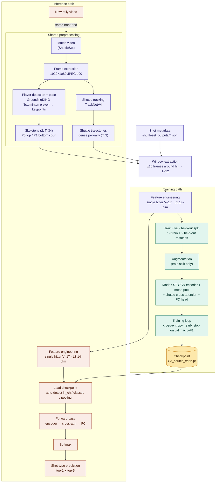

# Run 6 — training & inference pipeline

Training and inference share the same preprocessing front-end. The two paths
diverge only after feature engineering: training fits the model and emits a
checkpoint; inference loads that checkpoint and predicts. The checkpoint is the
single artifact that links them.

**How the two paths link**
- **Shared front-end** — both paths run the identical frame → pose → skeleton /
  shuttle extraction and the same window + feature-engineering steps
  (single hitter, V=17, L3 14-dim). Inference must not drift from training here.
- **Checkpoint hand-off** — training's only output that inference consumes is
  `C3_shuttle_xattn.pt`. The inference loader auto-detects architecture
  (`in_channels`, `num_classes`, pooling, cross-attention) from the weights.
- **Train-only steps** — the train/val/held-out split and augmentation exist
  only on the training path; inference sees neither.